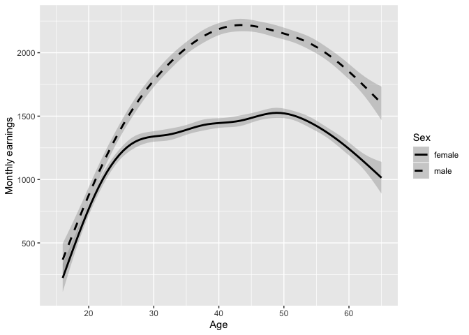
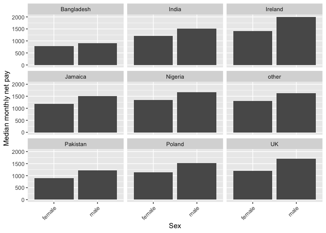
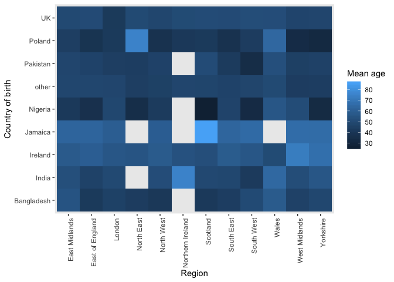
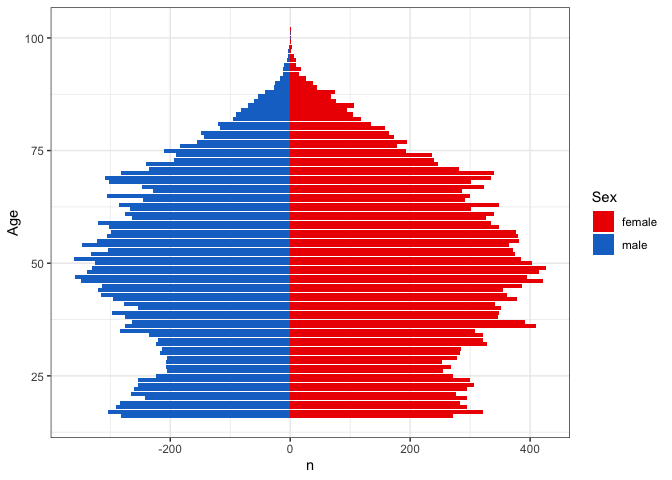

Statistical assignment 4
================
Francesca Hume: 660024948
27th February 2020

In this assignment you will need to reproduce 5 ggplot graphs. I supply
graphs as images; you need to write the ggplot2 code to reproduce them
and knit and submit a Markdown document with the reproduced graphs (as
well as your .Rmd file).

First we will need to open and recode the data. I supply the code for
this; you only need to change the file paths.

    ```r
    library(tidyverse)
    Data8 <- read_tsv("/Users/chescamae98/Desktop/UKDA-6614-tab/tab/ukhls_w8/h_indresp.tab")
    Data8 <- Data8 %>%
        select(pidp, h_age_dv, h_payn_dv, h_gor_dv)
    Stable <- read_tsv("/Users/chescamae98/Desktop/UKDA-6614-tab/tab/ukhls_wx/xwavedat.tab")
    Stable <- Stable %>%
        select(pidp, sex_dv, ukborn, plbornc)
    Data <- Data8 %>% left_join(Stable, "pidp")
    rm(Data8, Stable)
    Data <- Data %>%
        mutate(sex_dv = ifelse(sex_dv == 1, "male",
                           ifelse(sex_dv == 2, "female", NA))) %>%
        mutate(h_payn_dv = ifelse(h_payn_dv < 0, NA, h_payn_dv)) %>%
        mutate(h_gor_dv = recode(h_gor_dv,
                         `-9` = NA_character_,
                         `1` = "North East",
                         `2` = "North West",
                         `3` = "Yorkshire",
                         `4` = "East Midlands",
                         `5` = "West Midlands",
                         `6` = "East of England",
                         `7` = "London",
                         `8` = "South East",
                         `9` = "South West",
                         `10` = "Wales",
                         `11` = "Scotland",
                         `12` = "Northern Ireland")) %>%
        mutate(placeBorn = case_when(
                ukborn  == -9 ~ NA_character_,
                ukborn < 5 ~ "UK",
                plbornc == 5 ~ "Ireland",
                plbornc == 18 ~ "India",
                plbornc == 19 ~ "Pakistan",
                plbornc == 20 ~ "Bangladesh",
                plbornc == 10 ~ "Poland",
                plbornc == 27 ~ "Jamaica",
                plbornc == 24 ~ "Nigeria",
                TRUE ~ "other")
        )
    ```

Reproduce the following graphs as close as you can. For each graph,
write two sentences (not more\!) describing its main message.

1.  Univariate distribution (20 points).
    
    ``` r
    unidist<- ggplot(Data, aes(h_payn_dv), na.rm=TRUE)+
    geom_freqpoly(aes(y=..count..))+
    labs(x= "Net monthly pay",
         y= "Number of respondents")
    
    unidist
    ```
    
    <!-- -->

This Univaritate distribution shows that few respondents earn very low
net monthly pay, but that as the net monthly pay increases between the
values of £0 to around £1300 as does the number of respondents with this
net monthly pay; the majority of the respondents earn around £1300
value. From around et monthly pay of £1300 however, the number of
respondents decreases as net monthly pay increases; there is however a
small peak again at around £5400 net monthly pay.

2.  Line chart (20 points). The lines show the non-parametric
    association between age and monthly earnings for men and women.
    
    ``` r
    Data$Sex<- Data$sex_dv
    
    linechart<- ggplot(Data, aes(x = h_age_dv, y = h_payn_dv, color = Sex)) +
    geom_smooth(aes(linetype= Sex)) +
        labs(x= "Age",
             y= "Monthly earnings",
             colour = "Sex")+
        scale_x_continuous(breaks=seq(20,60, 10))+
        xlim(15,65)+
        scale_color_manual(values=c("black", "black"))+
        scale_linetype_manual(values = c("solid", "dashed"))
    
       linechart     
    ```
    
    <!-- -->

This line chart suggests that male respondents do, at all ages have a
monthly earning higher than females, however, the difference between the
sexs increases dramatically between the ages of around 25 and 60. Both
genders earnings increase up until around age 45 and then begin to
decrease however, the monthly earing of females fluctuate more so than
male earnings which increase more steadily; this is likely a result of
women taking time out when having children and then rejoining
employment, impacting their monthly earnings.

3.  Faceted bar chart (20 points).
    
    ``` r
    byeth <- Data %>%
        group_by(Sex, placeBorn) %>%
      summarise(
    medianIncome = median(h_payn_dv, na.rm = TRUE)
      )%>%
    filter(!is.na(Sex) & !is.na(placeBorn) & !is.na(medianIncome))
    
    
    plot<- ggplot(data = byeth, aes(x = Sex, y=medianIncome)) +
      geom_bar(stat="identity") + facet_wrap( ~ placeBorn) +
      theme(axis.text.x = element_text(angle=45, hjust=1))+
    ylab("Median monthly net pay")
    
     plot 
    ```
    
    <!-- -->

This faceted bar chart suggests that regardless of place of birth, males
always have a median monthly net income higher than females. There is
however some variation in the differences between the genders with for
exmaple Irish born men having a higher median than the other places of
birth and having a larger differnce between males and females than for
example, Bangladeshi borns.

4.  Heat map (20 points).
    
    ``` r
    heatmapdata<- Data %>%
        group_by(h_gor_dv, placeBorn) %>%
      summarise(meanage = mean(h_age_dv, na.rm = TRUE))%>%
        filter(!is.na(h_gor_dv) & !is.na(placeBorn) & !is.na(meanage))
    
    
    heatmap<- ggplot(heatmapdata, aes(x = h_gor_dv, y= placeBorn, fill=meanage  ))+
        geom_tile(aes(na.rm=TRUE))+
        labs(x = "Region",
             y= "Country of birth",
             fill = "Mean age")+
      theme(axis.text.x = element_text(angle=90, hjust=1))+
        theme(
      panel.border = element_blank(),
      panel.grid.major = element_blank(),
      panel.grid.minor = element_blank(),
      axis.line = element_line(colour = "white")
      )
    
    
    heatmap
    ```
    
    <!-- --> The
    heat map shows that there is variation in the average age of people
    dependent on country of birth and the region in which they live. The
    highest mean age is found for individuals born in Nigerian and
    living in Scotland and the lowest mean age is foudn for individuals
    born in Jamaica and living in Scotland; there are also some areas
    with no data indicated by the empty squares such as those born in
    Nigeria and living in Northern Ireland.

5.  Population pyramid (20 points).
    
    ``` r
    pp<- ggplot(Data, aes(x= h_age_dv, fill = Sex))+
        geom_bar(data=subset(Data, Data$Sex =="female"))+
        geom_bar(data=subset(Data, Data$Sex == "male"), aes(y=..count..*(-1)))+
        coord_flip()+
        labs(x= "Age",
             y= "n"
             )+
        scale_fill_manual(values= c("red2", "dodgerblue3"))+
        theme_bw()
    
    pp
    ```
    
    <!-- -->

The population pyramid highlights that within the data, the pattern in
males and females is similar- i.e. both have indents around late 20s
early 30s with a lower n (frequency), both have the largest number of
individuals between the ages of approximately 50, and both begin have
quickly reducing frequencies of individuals in ages over 75. There are
though, larger numbers of females than males with females for example,
have some frquencies over 400, whereas none of the males ages are higher
than around 380.
